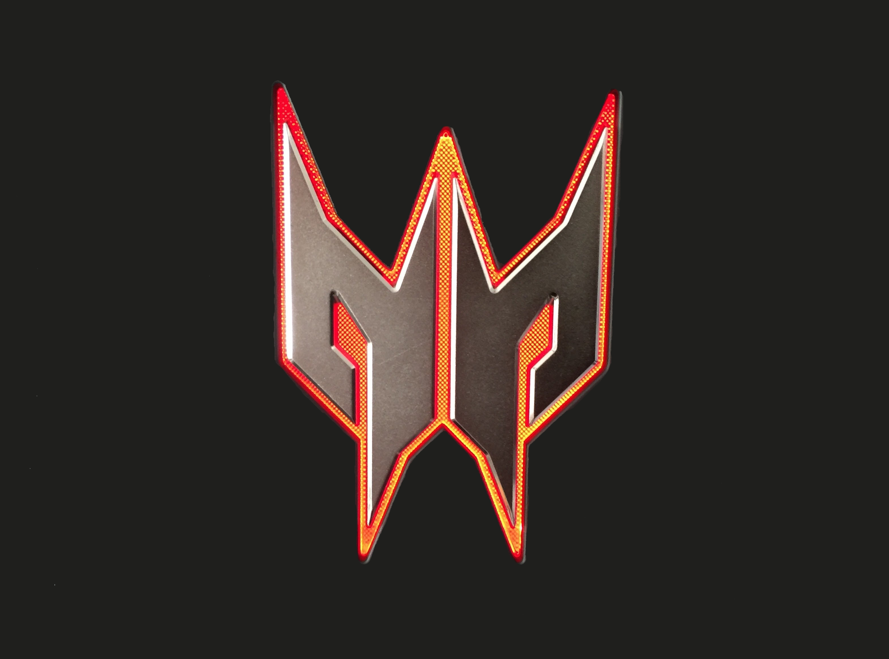

<!--
HOW TO USE:
This is an example of how you may give instructions on setting up your project locally.

Modify this file to match your project and remove sections that don't apply.

REQUIRED SECTIONS:
- Table of Contents
- About the Project
  - Built With
  - Live Demo
- Getting Started
- Authors
- Future Features
- Contributing
- Show your support
- Acknowledgements
- License

OPTIONAL SECTIONS:
- FAQ

After you're finished please remove all the comments and instructions!
-->

  <!-- You are encouraged to replace this logo with your own! Otherwise you can also remove it. -->
  
   

  <h3><b>Hello Microverse</b></h3>

<!-- TABLE OF CONTENTS -->

# 📗 Table of Contents

- [📖 About the Project](#about-project)
  - [🛠 Built With](#built-with)
    - [Tech Stack](#tech-stack)
    - [Key Features](#key-features)
- [💻 Getting Started](#getting-started)
- [👥 Authors](#authors)
- [🔭 Future Features](#future-features)
- [⭐️ Show your support](#support)
- [📝 License](#license)

<!-- PROJECT DESCRIPTION -->

# 📖 Hello Microverse 

**Hello Microverse** is the first project in Microverse Bootcamp.  
In this project, we have created a simple HTML and CSS page using linters and github workflow.

## 🛠 Built With 

### Tech Stack 

  
HTML

  
CSS

(<a href="#readme-top">back to top</a>)

<!-- Features -->

### Key Features 

- **First this project needs node and npm modules**
- **Second this project was created using best coding practices**
- **Third this project uses a MIT license**

(<a href="#readme-top">back to top</a>)

<!-- GETTING STARTED -->

## 💻 Getting Started 

To get a local copy up and running, follow these steps.

- clone this repository to your desired folder
- open the HTML file

(<a href="#readme-top">back to top</a>)

<!-- AUTHORS -->

## 👥 Authors 

👤 **Dani Morillo**

- [GitHub](https://github.com/danifromecuador)
- [Twitter](https://twitter.com/danifromecuador)
- [LinkedIn](https://linkedin.com/in/danifromecuador)

(<a href="#readme-top">back to top</a>)

<!-- FUTURE FEATURES -->

## 🔭 Future Features 

- **I will add a background color**
- **I will add a lorem ipsum paragraph**
- **I will add an image**

(<a href="#readme-top">back to top</a>)

<!-- SUPPORT -->

## ⭐️ Show your support 

If you like this project write me a [message](https://twitter.com/danifromecuador), i will be happy to hearing about you.

(<a href="#readme-top">back to top</a>)

<!-- LICENSE -->

## 📝 License 

This project is [MIT](./LICENSE) licensed.

(<a href="#readme-top">back to top</a>)
